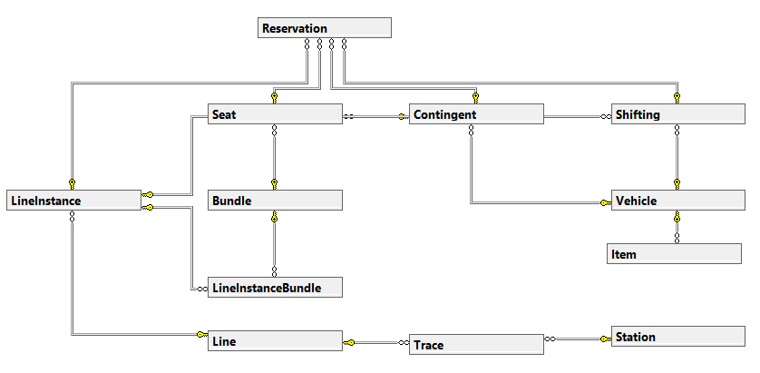

# Vítejte v dokumentaci rezervačního systému

Tento systém vám umožní efektivně spravovat rezervace sedadel a dalších služeb v rámci naší dopravní sítě. Každý spoj je tvořen jedním nebo více vozy, které obsahují různé typy contingentů - abstraktní bloky sedadel nebo jiných prvků, jako jsou například místa pro jízdní kola nebo zvířata. 

Naše vozidla jsou specifická svým pořad
ím v soupravě a detailním popisem, poskytující cestujícím veškerý komfort. Každý spoj se vyznačuje unikátním číslem a trasou, například R1322, které zajišťují pravidelné spoje mezi městy jako Liberec a Ústí nad Labem.

Pro úspěšnou rezervaci je nezbytné znát linku, stanice odjezdu a příjezdu a datum jízdy. Naše systémová API poskytují přehledný seznam stanic a umožňují efektivní vyhledávání tras a volných míst. Rezervace sedadel a dalších služeb je zajištěna přesně podle vašich potřeb, s důrazem na detail a pohodlí cestujících.

### Náhled modelu

Využijte našeho systému pro pohodlné a efektivní plánování vašich cest. Naše dokumentace vám poskytne všechny potřebné informace k navigaci a využití našeho rezervačního systému. Dobrou cestu!

