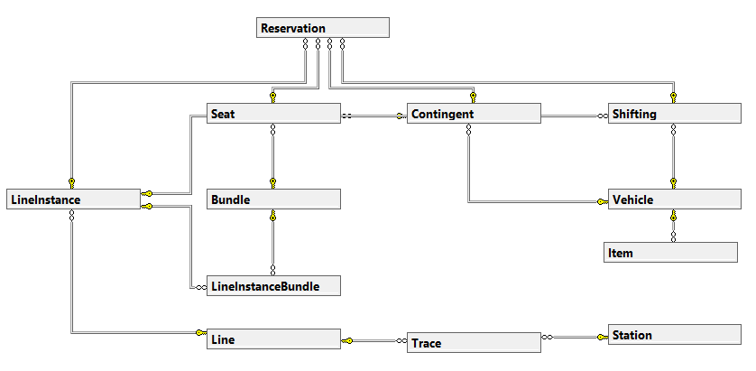

# Welcome to the Reservation System Documentation

This system enables you to efficiently manage seat reservations and other services within our transportation network. Each connection consists of one or more carriages, containing various types of contingents - abstract blocks of seats or other elements such as spaces for bicycles or animals.

Our vehicles are uniquely characterized by their order in the train composition and detailed description, providing passengers with utmost comfort. Each connection is marked by a unique number and route, for example, R1322, ensuring regular connections between cities like Liberec and Ústí nad Labem.

For successful reservation, it is essential to know the route, departure and arrival stations, and the date of travel. Our system's API provides a clear list of stations and enables efficient searching of routes and available seats. The reservation of seats and other services is tailored to your needs, with an emphasis on detail and passenger comfort.

### Model preview

Utilize our system for convenient and effective planning of your journeys. Our documentation will provide you with all the necessary information for navigation and use of our reservation system. Have a pleasant journey!

